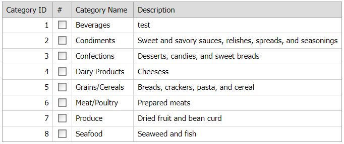

<!-- default badges list -->

[](https://supportcenter.devexpress.com/ticket/details/E3587)
[](https://docs.devexpress.com/GeneralInformation/403183)
[](#does-this-example-address-your-development-requirementsobjectives)
<!-- default badges end -->
# Grid View for ASP.NET Web Forms - How to add a column if the AutoGenerateColumns property is set to true
This example demonstrates how to add a column to the grid when the AutoGenerateColumns property is enabled.



## Overview

When the [AutoGenerateColumns](https://docs.devexpress.com/AspNet/DevExpress.Web.ASPxGridView.AutoGenerateColumns) property is set to `true`, handle the [DataBound](https://docs.devexpress.com/AspNet/DevExpress.Web.ASPxDataWebControlBase.DataBound) event to add a column to the [Grid View](https://docs.devexpress.com/AspNet/DevExpress.Web.ASPxGridView) control. Before you add a column, check whether this column already exists to avoid duplicate columns.

```aspx
<dx:ASPxGridView ID="ASPxGridView1" runat="server" AutoGenerateColumns="True" 
    KeyFieldName="CategoryID" ondatabound="ASPxGridView1_DataBound">
</dx:ASPxGridView>
```

```cs
protected void ASPxGridView1_DataBound(object sender, EventArgs e) {
    if (grid.Columns.IndexOf(grid.Columns["CommandColumn"]) != -1)
        return;
    GridViewCommandColumn col = new GridViewCommandColumn();
    col.Name = "CommandColumn";
    // ...
    grid.Columns.Add(col);
}
```

## Files to Review

* [Default.aspx](./CS/WebSite/Default.aspx) (VB: [Default.aspx](./VB/WebSite/Default.aspx))
* [Default.aspx.cs](./CS/WebSite/Default.aspx.cs) (VB: [Default.aspx.vb](./VB/WebSite/Default.aspx.vb))

## More Examples

* [Grid View for ASP.NET MVC - How to add a column if the AutoGenerateColumns property is set to true](https://github.com/DevExpress-Examples/mvc-gridview-add-column-to-autogenerated-columns)
<!-- feedback -->
## Does this example address your development requirements/objectives?

[](https://www.devexpress.com/support/examples/survey.xml?utm_source=github&utm_campaign=asp-net-web-forms-grid-add-column-to-autogenerated-columns&~~~was_helpful=yes) [](https://www.devexpress.com/support/examples/survey.xml?utm_source=github&utm_campaign=asp-net-web-forms-grid-add-column-to-autogenerated-columns&~~~was_helpful=no)

(you will be redirected to DevExpress.com to submit your response)
<!-- feedback end -->
